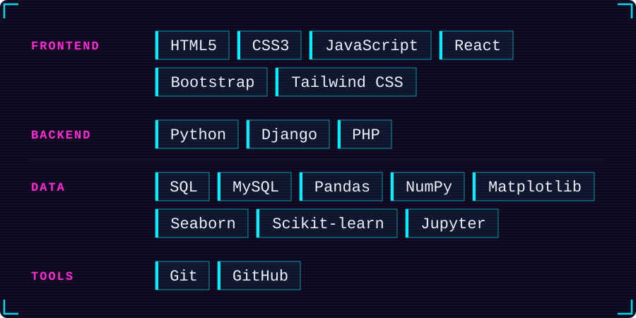
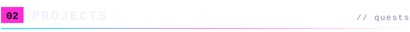
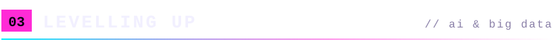
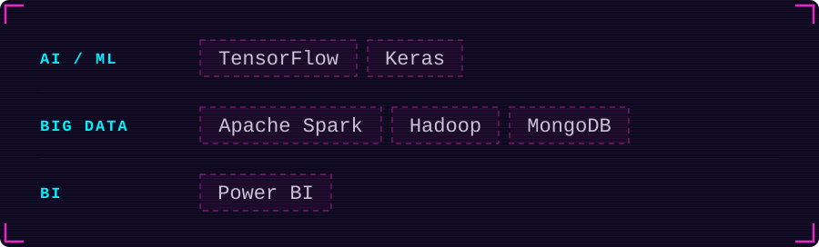
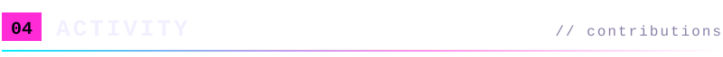
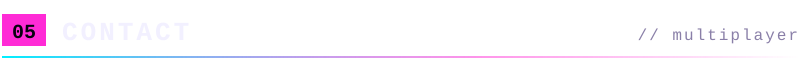

<!-- ══════════════════════════  HEADER  ══════════════════════════ -->

  

  <a href="README.md">Español</a> · <b>English</b>

<!-- ══════════════════════════  INTRO  ═══════════════════════════ -->

  I started out with cables, networks and hardware. Today I build web apps end to end, I'm specialising in Python and levelling up towards AI and Big Data.

  

<!-- ══════════════════════════  01 STACK  ════════════════════════ -->

  

 

<!-- ══════════════════════════  02 PROJECTS  ═════════════════════ -->

<!-- Once you have the screenshot (1280x720) at assets/projects/agrodatalab.png, uncomment:

  

-->

  
  &nbsp;
  

  Final project built as a team with <a href="https://github.com/Dangelcrack">@Dangelcrack</a>

 

 

<!-- ══════════════════════════  03 LEVELLING UP  ═════════════════ -->

`▸ studying` &nbsp; **Python** Specialisation Course — backend, automation and data analysis

`▸ queued` &nbsp; What I'm learning next for AI and Big Data:

  

`▸ background` &nbsp; Higher Diploma in Web Development · Diploma in IT Systems and Networks

 

<!-- ══════════════════════════  04 ACTIVITY  ═════════════════════ -->

  <picture>
    <source media="(prefers-color-scheme: dark)" srcset="https://raw.githubusercontent.com/Alpaber/Alpaber/output/snake-dark.svg" />
    <source media="(prefers-color-scheme: light)" srcset="https://raw.githubusercontent.com/Alpaber/Alpaber/output/snake-light.svg" />
    
  </picture>

 

<!-- ══════════════════════════  05 CONTACT  ══════════════════════ -->

  
  &nbsp;
  

  

