<!-- ══════════════════════════  HEADER  ══════════════════════════ -->

  

  <b>Español</b> · <a href="README.en.md">English</a>

<!-- ══════════════════════════  INTRO  ═══════════════════════════ -->

  Empecé por los cables, las redes y los equipos. Hoy construyo aplicaciones web de principio a fin, me estoy especializando en Python y voy subiendo de nivel hacia la IA y el Big Data.

  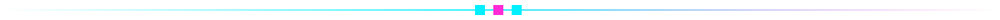

<!-- ══════════════════════════  01 STACK  ════════════════════════ -->
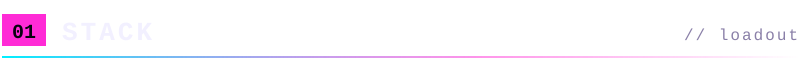

  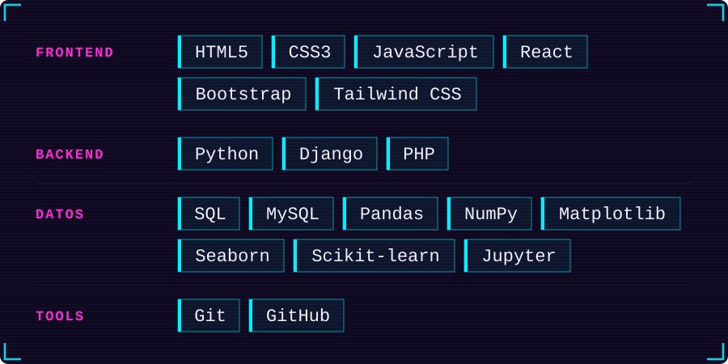

 

<!-- ══════════════════════════  02 PROYECTOS  ════════════════════ -->
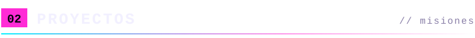

<a href="https://github.com/Alpaber/agrodatalab-enviropro">
  
</a>

<!-- Cuando tengas la captura de la web (1280x720) en assets/projects/agrodatalab.png, descomenta esto:

  

-->

  
  &nbsp;
  

  Proyecto final en equipo con <a href="https://github.com/Dangelcrack">@Dangelcrack</a>

 


<!--
  PLANTILLA PARA NUEVOS PROYECTOS
  1. Añade una llamada a project_card(...) en assets/_build_assets.py y ejecútalo
  2. Captura 1280x720 en assets/projects/nombre.png

  
  &nbsp;
  

-->

 

<!-- ══════════════════════════  03 SUBIENDO DE NIVEL  ════════════ -->
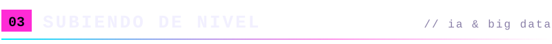

`▸ completado` &nbsp; Curso de Especialización en **Python** — backend, automatización y análisis de datos

`▸ estudiando` &nbsp; Curso de Especialización en **IA y Big Data**. Tecnologías que estoy aprendiendo:

  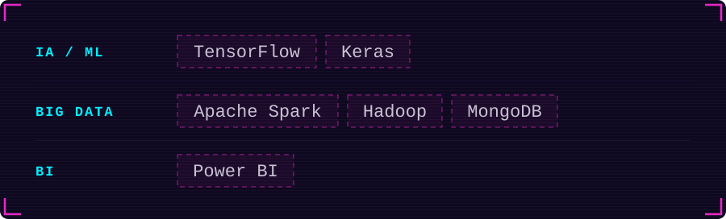

`▸ base` &nbsp; Grado Superior en Desarrollo Web · CFGM Sistemas Microinformáticos y Redes

 

<!-- ══════════════════════════  04 ACTIVIDAD  ════════════════════ -->
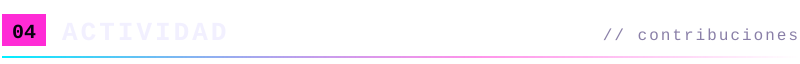

  <picture>
    <source media="(prefers-color-scheme: dark)" srcset="https://raw.githubusercontent.com/Alpaber/Alpaber/output/snake-dark.svg" />
    <source media="(prefers-color-scheme: light)" srcset="https://raw.githubusercontent.com/Alpaber/Alpaber/output/snake-light.svg" />
    
  </picture>

 

<!-- ══════════════════════════  05 CONTACTO  ═════════════════════ -->
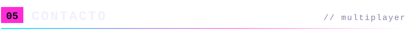

  
  &nbsp;
  

  

